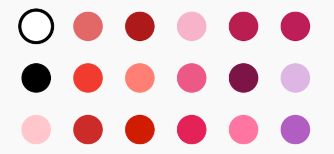
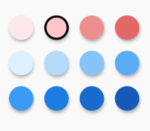

# Caviare Flutter Color Picker [](https://pub.dev/packages/caviare_flutter_colorpicker)

一个Material风格GridView形式的颜色选择器。默认情况下，它包含的是Material颜色，但你可以定义自己的颜色。
它支持竖向滚动和横向滚动，可以定义纵轴上Color圆点的数量，如果不指定它会自动填满纵轴。它会自动适配，以让出现在屏幕伤的都是完整的Color圆。

## 如何使用

### 添加到你的Fluter项目

添加 `flutter_material_color_picker` 到 pubspec.yaml 文件中。

```yaml
caviare_flutter_colorpicker: ^1.0.1
```
### Import

```dart
import 'package:caviare_flutter_colorpicker/caviare_flutter_colorpicker.dart';
```
### 基本使用

```dart
MaterialColorPicker(
    scrollDirection: Axis.horizontal, // 指定滚动方向
    crossAxisCircleNum: 3, // 指定纵轴的Color圆点的数量
    selectedColor: Colors.red, // 指定选择的Color圆点
    onColorChange: (Color color) {
        // 处理颜色修改
    },
)
```


### 所有属性


```dart
Container(
width: 300,
height:
    300, // 指定主轴的Size（vertical是height， horizontal是width），可以使其在在此范围内滚动
child: ColorListPicker(
    selectedColor: Color(0xFFFFCDD2), // 选择的颜色
    onColorChange: (Color color) {
      // 处理颜色修改
    },
    colors: [
      Color(0xFFFFEBEE),
      Color(0xFFFFCDD2),
      Color(0xFFEF9A9A),
      Color(0xFFE57373),
      Color(0xFFE3F2FD),
      Color(0xFFBBDEFB),
      Color(0xFF90CAF9),
      Color(0xFF64B5F6),
      Color(0xFF42A5F5),
      Color(0xFF1E88E5),
      Color(0xFF1976D2),
      Color(0xFF1565C0),
    ], // 指定颜色集
    circleSize: 45, // Color圆点的直径
    spacing: 20, // Color圆点之间的间距
    crossAxisCircleNum: 4,// 纵轴Color圆点的数量，不指定或设为0会根据纵轴（这里是width）的长度自动计算
    scrollDirection: Axis.vertical,
    borderSize: 4, // 选中圈的Size
    borderColor: Colors.black, // 选中圈的颜色
    elevation: 4 // 决定Material阴影效果
    ),
),
```
